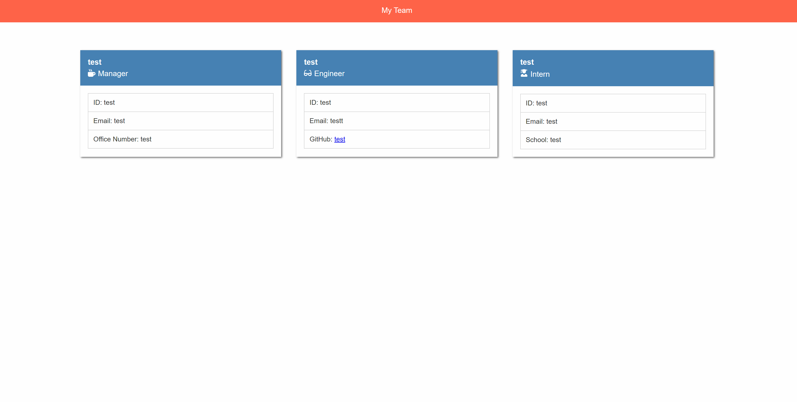

# Team Profile Generator


## Description

This command-line application generates a polished and responsive HTML file for listing your team members.

## Table of Contents

* [Installation](#Installation)
* [Usage](#Usage)
* [License](#License)
* [Contributing](#Contributing)
* [Tests](#Tests)
* [Questions](#Questions)
* [Video Walkthrough](#Video%Walkthrough)
* [Screen Shot](#Screen%Shot)

## Installation

To install the Team Profile Generator, run ```npm i inquirer``` in the command line. To invoke the prompts, run ```node index``` in the command line.

## Usage

Enter criteria as prompted by the Generator. Your HTML file will appear in the 'output' folder

## License

MIT

## Contributing

This is an open-source package that anyone can contribute to.

## Tests

First, install Jest with ```npm install --save-dev jest``` and then run ```npm run test``` in the command line to run all four tests at once, or ```npm run test [file name]``` for imdividual tests.

## Questions

For additional information please contact me via GitHub at [https://github.com/malicea0783](https://github.com/malicea0783) or via email at [malicea0783@gmail.com](mailto:malicea0783@gmail.com?subject=[GitHub]%Team%Profile%Generator).

## Video Walkthrough
[Video Walkthrough Link](https://drive.google.com/file/d/1ugXcgOfb-zl5LSQnh4CY9tbot5Um5eNZ/view)

## Screen Shot
